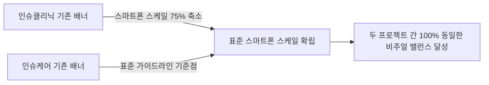

# 📱 [디자인 기획서] 인슈케어 vs 인슈클리닉 커피 배너 스마트폰 크기 일관화 개선안

> **문서 버전:** v1.0  
> **작성 일자:** 2026. 09. 04  
> **대상 프로젝트:** `insucare` (인슈케어) / `insuclinic` (인슈클리닉)  
> **대상 파일:** `public/coffee_event_banner.jpg`  
> **핵심 목표:** 두 프로젝트의 커피 증정 배너 내 **스마트폰 UI 크기 및 스케일을 표준화하여 브랜드 시각적 통일성 및 완성도 극대화**

---

## 1. 현황 분석 및 문제점

### 1.1 두 배너 간 스마트폰 크기 비교 분석

| 비교 항목 | 🐰 인슈케어 (`insucare`) 배너 | 🦁 인슈클리닉 (`insuclinic`) 배너 | 분석 결과 및 문제점 |
| :--- | :--- | :--- | :--- |
| **스마트폰 세로 크기** | **전체 배너 높이 대비 약 48%** (표준/안정적) | **전체 배너 높이 대비 약 68%** (과도하게 큼) | 인슈클리닉 배너의 스마트폰이 너무 커서 상단 타이틀과 하단 영역을 과도하게 압박 |
| **캐릭터 대비 비례** | 토끼 귀 중간 높이에 위치, 캐릭터와 자연스러운 조화 | 토끼 귀보다 높게 솟아있어 스마트폰이 캐릭터를 압도함 | 캐릭터 중심의 친근한 톤앤매너 훼손 |
| **스마트폰 테두리/여백** | 얇은 슬림 베젤, 상하좌우 여백이 여유로움 | 두꺼운 베젤, 좌측 및 상단 여백이 좁아 답답함 | 동일 패밀리 서비스임에도 이질적인 그래픽 느낌 부여 |
| **하단 로고 영역** | `보드미 보험 케어` | `핀토스 인슈클리닉` | 텍스트는 정상 분기되었으나 비주얼 스케일 불일치 |

---

## 2. 개선 방향 및 표준화 가이드라인



### 2.1 스마트폰 UI 표준 규격 (Design Standard)
1. **스케일 기준:** 
   - 스마트폰 높이를 배너 전체 캔버스 높이 대비 **약 48% ~ 50% 수준**으로 통일 (인슈케어 기준에 맞춤).
2. **Y축 정렬 (수직 위치):**
   - 상단 헤드라인 텍스트와의 간격: 최소 `80px` 이상 확보하여 시각적 개방감 부여.
   - 하단 브랜드 영역(`핀토스 인슈클리닉 / 보드미 보험 케어`) 상단 라인과 자연스럽게 맞닿도록 배치.
3. **X축 정렬 (수평 위치 및 캐릭터 간격):**
   - 좌측 마진: 캔버스 좌측 끝에서 `60~70px` 여백 유지.
   - 우측 캐릭터(토끼)와의 간격: 토끼 손/팔과 적절한 간격을 두어 커피 원두/하트 데코레이션이 자연스럽게 들어가도록 배치.
4. **내부 기프티콘 요소 유지:**
   - 스마트폰 내부의 메가커피 로고(MGC), QR코드, 바코드, "아이스 아메리카노" 텍스트의 선명도와 가독성 완벽 보존.

---

## 3. 세부 레이아웃 수정 설계안

```
┌────────────────────────────────────────────────────────────────────────┐
│                        보험 상담만 받아도?!                              │
│                메가커피 기프트콘 즉시 증정!                              │
│                                                                        │
│   ┌────────┐                               ┌─────────────┐             │
│   │ 📱폰   │        🐰 토끼      🐶 비숑   │상담신청하고 │  🦁 사자    │
│   │ [MGC]  │        (체리핀)    (커피들고) │커피 받자!   │  (후드티)   │
│   │ [QR]   │                               └─────────────┘             │
│   │ [바코드]│                                                          │
│   └────────┘                                                           │
│  ───────────────────────────────────────────────────────────────────   │
│  핀토스 인슈클리닉  │  간단한 본인 인증 후 3분 상담을 완료하시면 메가커피 기프티콘을 드립니다.   │
└────────────────────────────────────────────────────────────────────────┘
  ▲ 스마트폰 크기를 토끼 키(귀 라인)와 조화롭게 축소하여 안정적인 3단 구도 확립
```

### 3.1 프로젝트별 적용 계획

1. **인슈클리닉 (`insuclinic`)**:
   - 스마트폰 일러스트 크기를 기존 대비 **약 72% 수준으로 축소 리사이징**.
   - 캐릭터 3종(토끼, 비숑, 사자)의 배치와 말풍선 위치를 최적 밸런스로 재배치.
   - `public/coffee_event_banner.jpg` 파일 교체 및 `App.tsx` 캐시 버전 파라미터(`?v=4`) 갱신.

2. **인슈케어 (`insucare`)**:
   - 이미 안정적인 크기 비율을 유지하고 있으므로, 인슈클리닉 수정본과 베젤 두께 및 디테일 컬러 톤을 1:1 최종 대조하여 완전한 동일 규격 적용.

---

## 4. 기대 효과

1. **브랜드 패밀리 룩 완성**: 두 서비스 간의 UI/UX 디자인 에셋 규격이 통일되어 완성도 높은 플랫폼 경험 제공.
2. **시각적 답답함 해소**: 스마트폰이 지나치게 커서 생기던 좌측 쏠림 현상을 해소하고, 타이틀과 캐릭터 간의 시선 흐름이 매끄러워짐.
3. **심의 및 가독성 향상**: 하단 안내문구 및 상단 심의 관련 텍스트와의 여백이 충분히 확보되어 심의 검토 시에도 긍정적 평가 유도.

---

## 5. 실행 단계 (Action Plan)

- [ ] **Step 1:** 인슈케어 스마트폰 크기 비율에 맞춰 인슈클리닉 커피 배너의 스마트폰 크기 및 위치 조정 이미지 제작
- [ ] **Step 2:** `c:\workspace\insuclinic\public\coffee_event_banner.jpg` 에셋 교체
- [ ] **Step 3:** `App.tsx` 내 배너 이미지 캐시 파라미터 업데이트 (`v=4`)
- [ ] **Step 4:** 빌드 검증 및 깃헙 커밋/푸시
